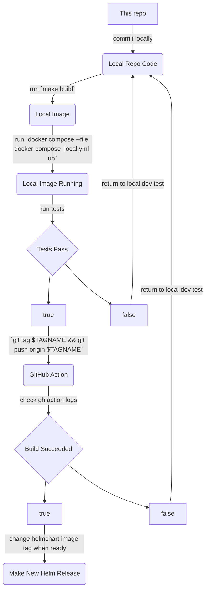

# A Docker Image Build Repository for the Texas Water Data Hub

## CI/CD

1. git tag v*.*._-_-\*
2. git push origin v*.*._-_-\*

## DEVOPS PIPELINE DIAGRAM



## Building the Image Locally

- Review the [Makefile](https://github.com/TNRIS/twdh_ckan_docker/blob/main/Makefile) for details
- Primary make targets:
  - `make build`: Build the image for PROD or DEV deployment. This build does not user Docker caching.
  - `make build-dev`: Build the image for local development. This version allows Docker's cache system to work, which makes for a much speedier build most of the time, but sometimes it doesn't pick up the changes you've made and you'll need to build without the cache turned on using `make build-dev-no-cache`. See Docker docs for details on how caching works.
  - `make build-dev-no-cache`: Build the image for local development without allowing Docker's cache.

## Development Use

### Running the Docker image locally

- First, build your local image as documented above.

- twdh_ckan_docker offers 3 development modes

  - `dev` runs the container normally, the way it will run on DEV/PROD
  - `nockan` starts the container and all of the services but does not start CKAN. In this mode, in order to start CKAN you need to exec into the Docker container and start CKAN like this:

    ```bash
    ckan -c production.ini run -H 0.0.0.0
    ```

    [See below](#running-the-docker-image-locally) for instructions on exec'ing into the container.

  - `debug` starts the container in a way that allows you to attach the VS Code debugger (INSTRUCTIONS NEEDED)
  - see [docker/ckan/setup/app/start_ckan_dev.sh](https://github.com/TNRIS/twdh_ckan_docker/blob/main/docker/ckan/setup/app/start_ckan_dev.sh) for more details

- If you need to override environment variables, create a file called `docker/.env-ckan.override.env`. This is useful for switching the DEV MODE or for experimenting with CKAN Config changes. For example:

  ```env
  # Set dev mode so that you can use pdb debugging
  TWDH_DEV_MODE=nockan

  # Change twdh.version
  CKAN___TWDH__VERSION=1.0.0

  # Set a static IP address if needed (not usually needed)
  CKAN_SITE_URL=http://192.168.7.236:5000
  CKAN___BEAKER__SESSION__COOKIE_DOMAIN=192.168.7.236
  CKANEXT__SECURITY__DOMAIN=192.168.7.236
  CKANEXT__SECURITY__MFA_HELP_LINK=http://192.168.7.236:5000/pages/mfa
  ```

- Start the docker containers by running this from the root of the twdh_ckan_docker repo:

  ```bash
  docker compose --file docker/docker-compose_local.yml up
  ```

- To exec into the container, run `docker ps` and retrieve the CONTAINER ID for the `29_ckan:default` container, then run

  ```bash
  docker exec -it {CONTAINER ID} bash
  ```

- Alternatively, add `/usr/lib/ckan/default/src/twdh_ckan_docker/scripts` to your `$PATH` and then run

  ```bash
  twdh-docker-exec
  ```
